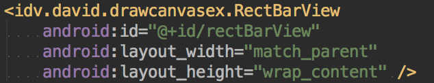
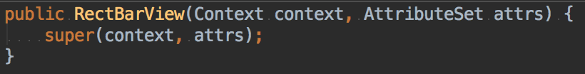
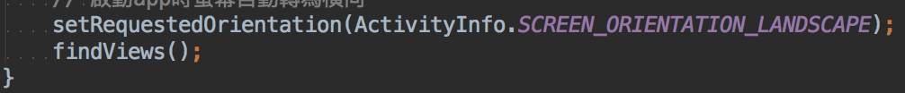
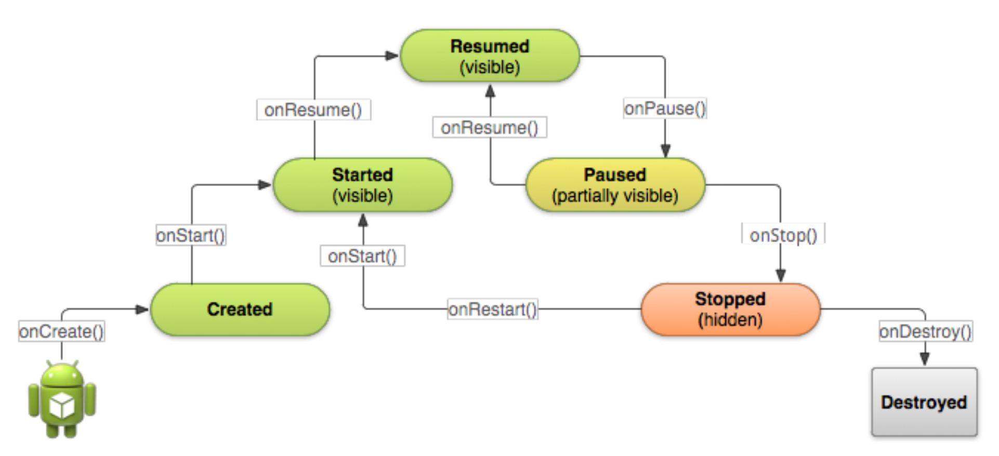
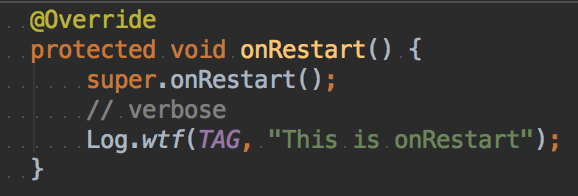
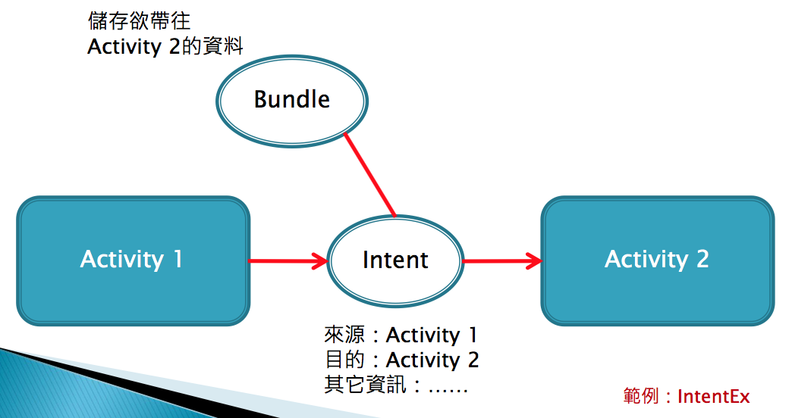
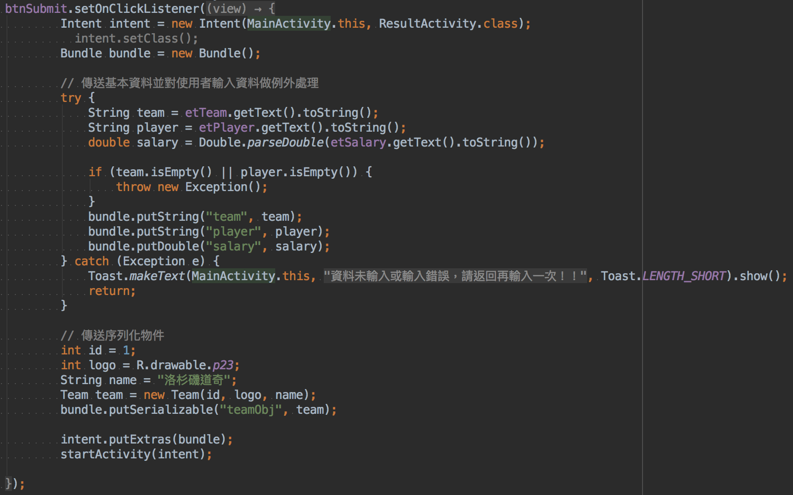
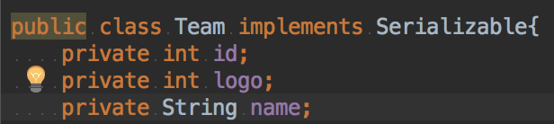
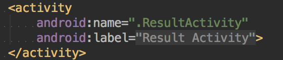

## 專題

* 可以用手勢辨識來翻頁
* 看文章要用自定義 view 


## 解決作業 2-1 的副標題

沒有解決！！


## 動畫

`android:repeatCount` 

* 無限重複播放 -1
* 不重複 0
* 重複兩次 1(原先一次再加上重複一次) 


`android:fromDegrees`

`android:toDegrees`

度度量


rotate一定要先於translate，否則rotate角度會錯誤 （會有風火輪的效果）


## 畫圖




不設定會閃退




景色（橫向）




人像（直向）


## 設計 button

stroke : 邊


## 第六章 Android Components

### Activity




* `onPause()` 暫停時會被叫起 （有訊息進入）
* Paused 部分可視
* Stopped 停止（有電話進入）





* `Log.wtf` : what a Terrible Failure


## Process

記憶體不足停止行程排列：

* 空行程
* 背景行程
* 服務行程
* 可視行程
* 前景行程


## Activity 間傳遞資料







```java
// MainActivity
Intent intent = new Intent(MainActivity.this, ResultActivity.class);
Bundle bundle = new Bundle();

bundle.putString("team", team);
bundle.putString("player", player);
bundle.putDouble("salary", salary);

bundle.putSerializable("teamObj", team);

intent.putExtras(bundle);
startActivity(intent);
```


## intent



序列化要 serializable




新的 intent 要在 AndroidManifest.xml 增加上面 activity 才能 intent ResultActivity 。


