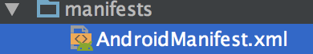

## 專題

* 可以用手勢辨識來翻頁
* 看文章要用自定義 view 

## 解決作業 2-1 的副標題

沒有解決！！

## 動畫

`android:repeatCount` 

* 無限重複播放 -1
* 不重複 0
* 重複兩次 1(原先一次再加上重複一次) 

`android:fromDegrees`

`android:toDegrees`

度度量

rotate一定要先於translate，否則rotate角度會錯誤 （會有風火輪的效果）

## 畫圖

不設定會閃退

景色（橫向）

人像（直向）

## 設計 button

stroke : 邊

## 第六章

### Activity

`onPause()` 暫停時會被叫起 （有訊息進入）

Paused 部分可視

Stopped 停止（有電話進入）

`Log.wtf` : what a Terrible Failure

## intent

序列化要 serializable

新的 intent 要在

