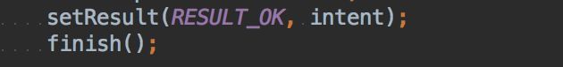
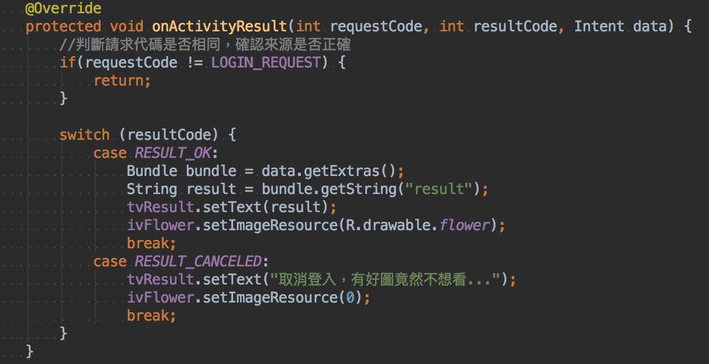

## Activity

`startActivity(intent);` 會增加 Activity 堆疊內

## 寫 ＢＭＩ程式 

homework4-1

## Activity 回傳

`startActivityForResult()`

* intent
* 請求代碼

改寫 `onActivityResult()`

第二個視窗 回傳前要做 `setResult`

要主動改寫 `onActivityResult`

## Intent Filter

發出求助訊號

