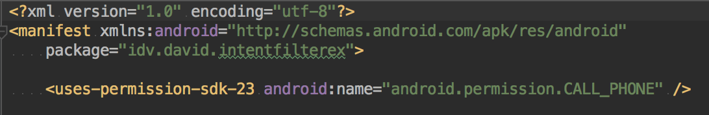
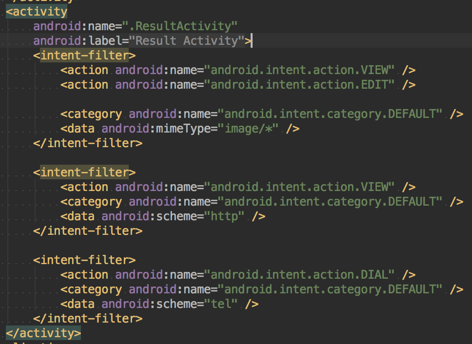
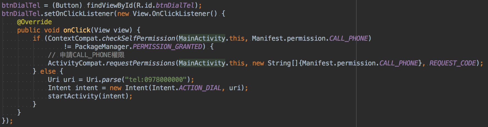
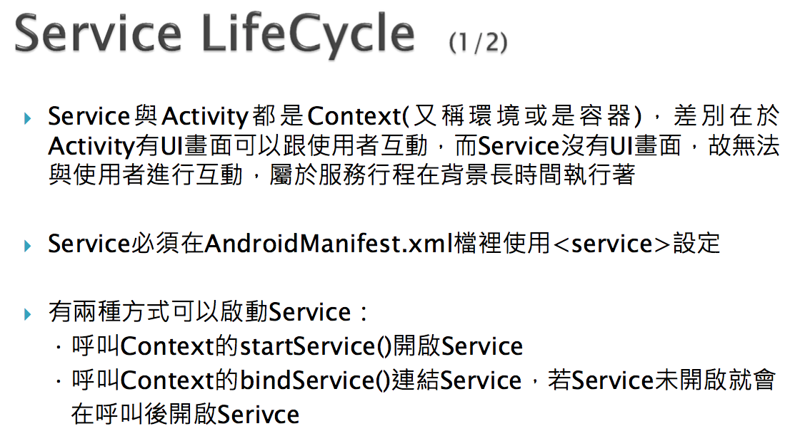
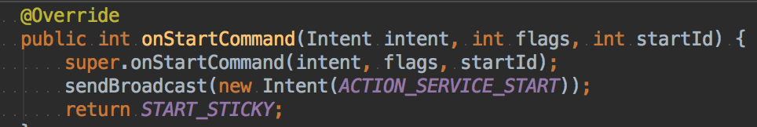

## Intent Filter

* 關於使用權同意問題
  * https://developer.android.com/guide/topics/permissions/requesting.html
* 設定寫在 manifest










* Uri 資源位置


## Notification

* NotificationManager 管理訊息


## Broadcast

* 例如電話打來，可以獲得其中的資料
* 要設定權限


```java
Build.VERSION_CODES.M (六點零版本)
```

* GSM (台灣 SMI 卡)
* CDMA


## Broadcast Sender


## Service LifeCycle




```java
private PowerManager.WakeLock wakeLock;
```




```java
return START_STICKY;
```

在 process 中如果關掉 service ，上面的指令會讓系統在資源足夠的情況下再度嘗試開啟 service。


## bindService

* 像是音樂播放