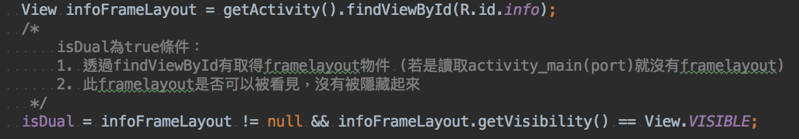
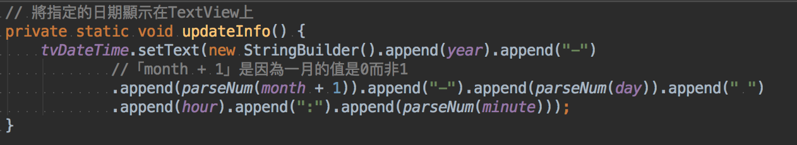
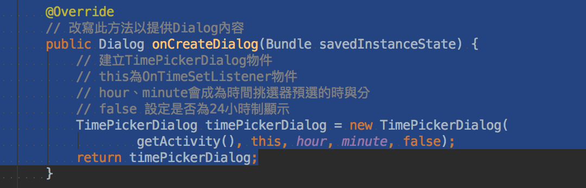

## Flexible Fragment UI

* land : landscape 橫向

* port : portrait 直向

* 可以用比重的方式，上面可以看到 `android:layout_weight="1"`

* 判斷手機方向

* 旋轉會把 Activity 刪掉，會讓資料刪掉，所以要把資料存起來

* 尺寸支援

https://developer.android.com/guide/practices/screens_support.html

* 像素 px，根據解析度來計算長度，所以不用 px
* Actual density (dpi) 
* px = dp *(dpi / 160)

## 專題

* 模擬器不要超過 6.0 會無法使用 sd card

## Alert Dialog

## Date/Time Picker Dialog

## Custom Dialog

## Action Bar

theme 要用 noActionBar

