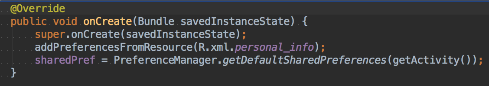

## Preference Fragment




`getDefaultSharedPreferences`  用預設的設定檔


## Internal Storage 內部存儲


## External Storage 外部存儲

```xml
<uses-permission android:name="android.permission.WRITE_EXTERNAL_STORAGE" />
```


* File 可以代表路徑。
* Bitmap 的使用。


## SQLite

回到首頁

到最末頁