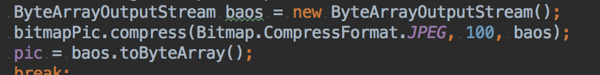

## SQLite

OOM: out of Memory

* Bitmap -> byte[]

* cursor 游標
* http://sqlitebrowser.org/ sql browser 

## SQL browser 使用

## Thread

main thread = UI thread

不可在其他執行緒執行 UI 功能

ans:

* 自己 post
* Handler -> Message —(sendToTarget())--> Message Queue
* AsyncTask
  * 可傳送資料
  * 中 publishProgress()
  * 結束獲得資料