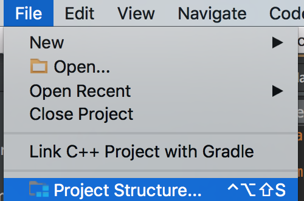

## 老師直接寫

* AsyncTask
  * 傳入什麼
  * 設定百分比
  * 最後拿到什麼資料
    * 可以是集合物件
  * onPreExecute(): doInBackground 之前
  * onPost … : doInBackground 之後

```Java
BufferedReader br = null;
StringBuilder sb = new StringBuilder();
try {
    URL url = new URL(params[0]);
  	HttpURLConnection con = (HttpURLConnection) url.openConnection();
  	con.setDoInput(true);
    con.setConnectTimeout(10000); // 10s
    con.setRequestMethod("GET");
    
    // InputStream is = con.getInputStream();
    // InputStreamReader isr = new InputStreamReader(is); // 處理中文
    // br = new BufferedReader(isr);
    br = new BufferedRreader(new InputStreamReader(con.getInputStream()));
    String str;
    while((str = br.readLine()) != null) {
        sb.append(str);
    }
} catch (IOException ie) {
    ...
} finally {
    if (br != null) {
        try {
            br.close();
        } catch (IOException ie) {
            ...
        }
    }
}

return sb.toString();
```

* 上面是 doInBackground


## Json

* 老師用 java 教學


## google Map

* v3 網路
* 要設定金鑰
* google api console




