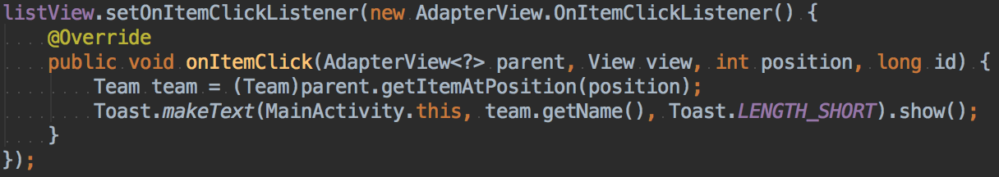
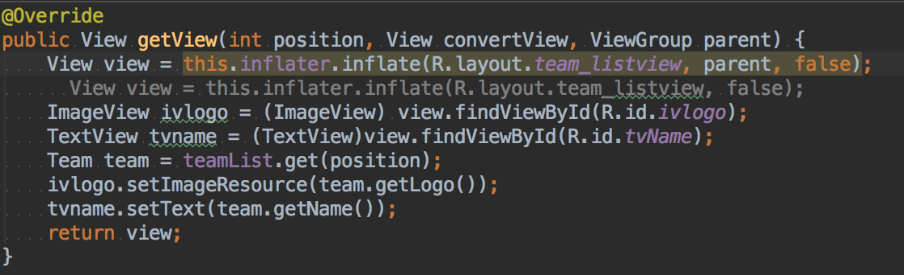
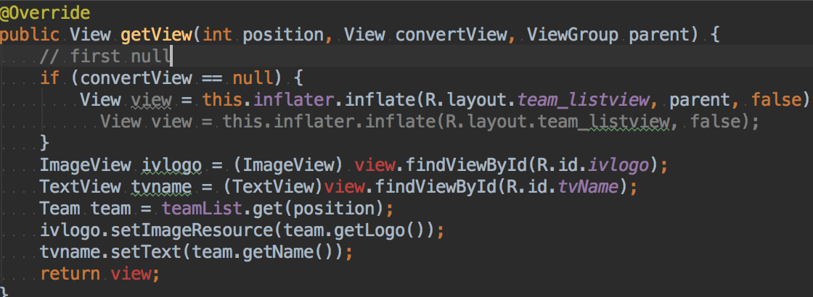
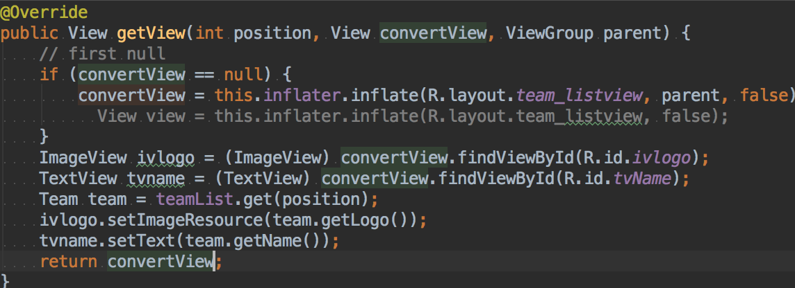
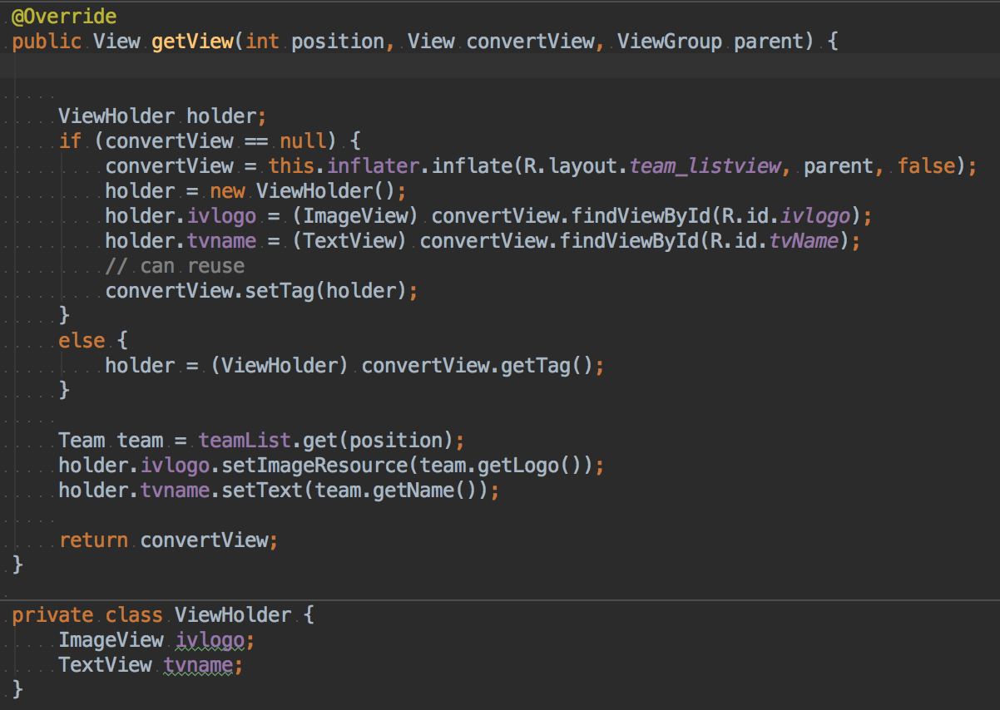
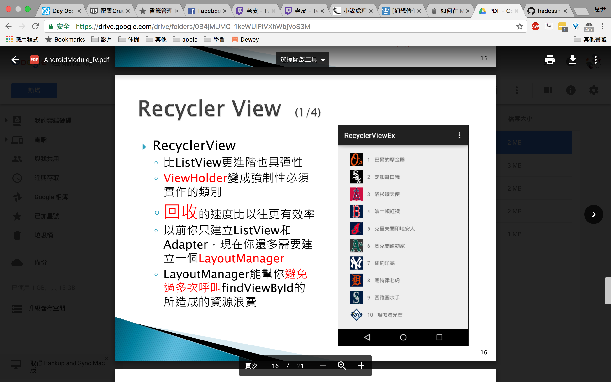
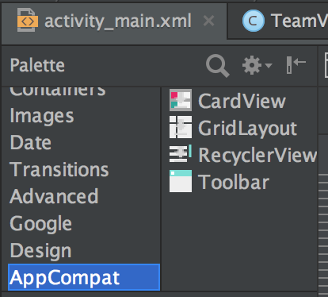
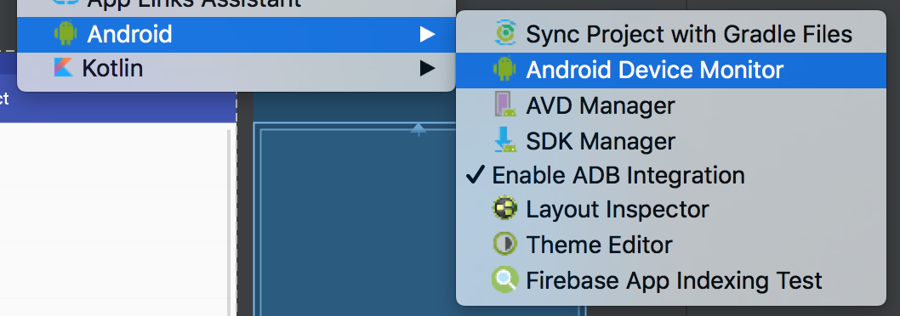
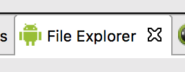

## getItem 連動

## 解決上一堂問題

重複 `gitView` 的問題。

*  從 `convrtView` 得到 `recycler` 資料。

* 修改 `View view`

`null` 代表第一次沒有載入。

* 還是有重複 `findviewbyid`， `ViewHolder` 綁 `View`。

綁在 `convertView` 可以重複使用。

`holder` 可以減少 `findViewbyid` 問題。

## Recycler View

改進 `listview` 的不用方法，且減少程式問題。

* 可以自動增加，到 xml ，`AppCompat` 新增，會自動問是否增加。

## Gesture

手勢

`ArrayList<Prediction> predictions = gestureLibrary.recognize(gesture);`

從資料中獲取 `gesture`，獲得預測值。

## 動畫

